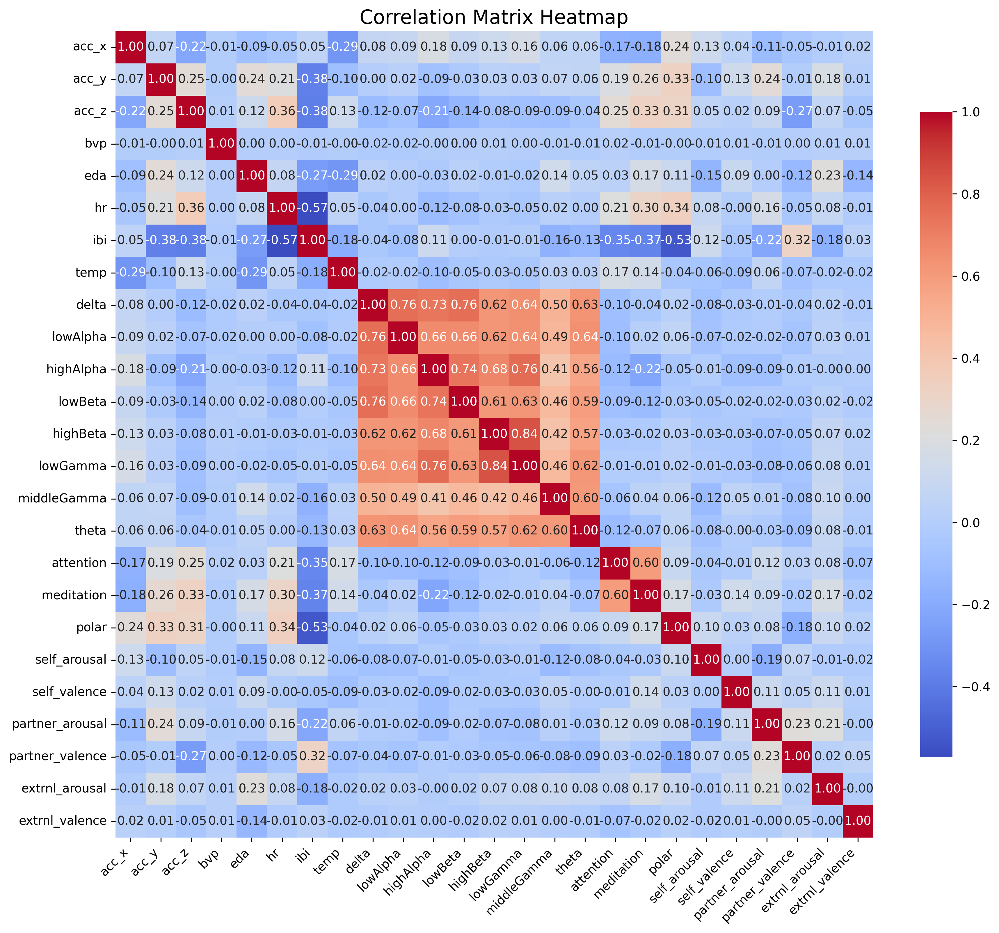

# K-EmoCon Dataset Analysis

This repository contains Python code to process and analyze data from the **K-EmoCon dataset**, as described in the paper ["K-EmoCon, a multimodal sensor dataset for continuous emotion recognition in naturalistic conversations"](https://www.nature.com/articles/s41597-020-00630-y). The dataset focuses on continuous emotion recognition using multimodal signals such as physiological data, speech, and facial expressions.

## Overview

The provided script performs the following tasks:

1. **Data Concatenation**: Reads multiple CSV files containing user information and combines them into a single file.
2. **Data Cleaning**: Removes unnecessary columns (e.g., timestamp) for analysis.
3. **Correlation Analysis**: Computes and visualizes the correlation matrix for the features in the dataset.

## Prerequisites

### Libraries Required
- `pandas`
- `seaborn`
- `matplotlib`

Install these libraries using pip:
```bash
pip install pandas seaborn matplotlib
```

## Code Explanation

### File Structure
- The dataset consists of user information stored in CSV files named in the format `user_{number}th_info.csv`.
- The code processes a predefined list of file numbers and concatenates them into a single file, `concatenate_all_files.csv`.

### Key Functionalities
- **File Handling**: Files are read in a loop, and missing files are handled gracefully with error messages.
- **Data Processing**: A timestamp column is dropped from the combined DataFrame.
- **Visualization**: A heatmap of the correlation matrix is generated and saved as `correlation_matrix_heatmap.png`.

## Usage

### Step 1: Organize Files
Place the CSV files in the same directory as the script. Ensure they follow the naming convention `user_{number}th_info.csv`.

### Step 2: Run the Script
Execute the script in Python:
```bash
python script_name.py
```

### Step 3: View Results
- The combined CSV file will be saved as `concatenate_all_files.csv`.
- The correlation heatmap will be saved as `correlation_matrix_heatmap.png`.

## Example Output

### Correlation Heatmap


The heatmap highlights the relationships between features in the dataset, enabling insights into feature dependencies.

## References
- Original Dataset Paper: [K-EmoCon](https://www.nature.com/articles/s41597-020-00630-y)
- Dataset Description: A multimodal sensor dataset for continuous emotion recognition in naturalistic conversations.
